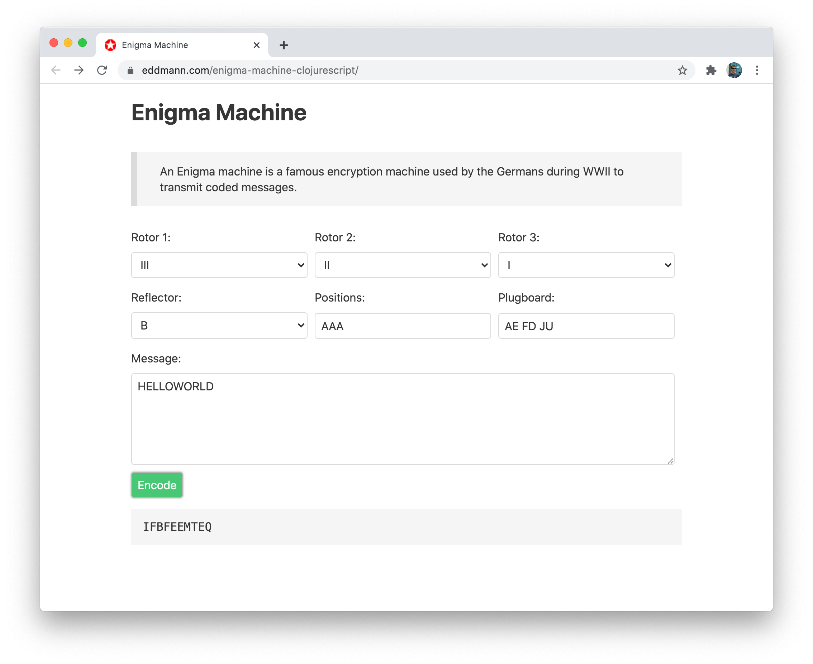

# Enigma Machine in ClojureScript

_Enigma Machine in ClojureScript, using Reagent and Property-based testing_

Demo: [https://eddmann.com/enigma-machine-clojurescript/](https://eddmann.com/enigma-machine-clojurescript/) 
Article: [https://eddmann.com/posts/building-an-enigma-machine-in-clojurescript/](https://eddmann.com/posts/building-an-enigma-machine-in-clojurescript/)

